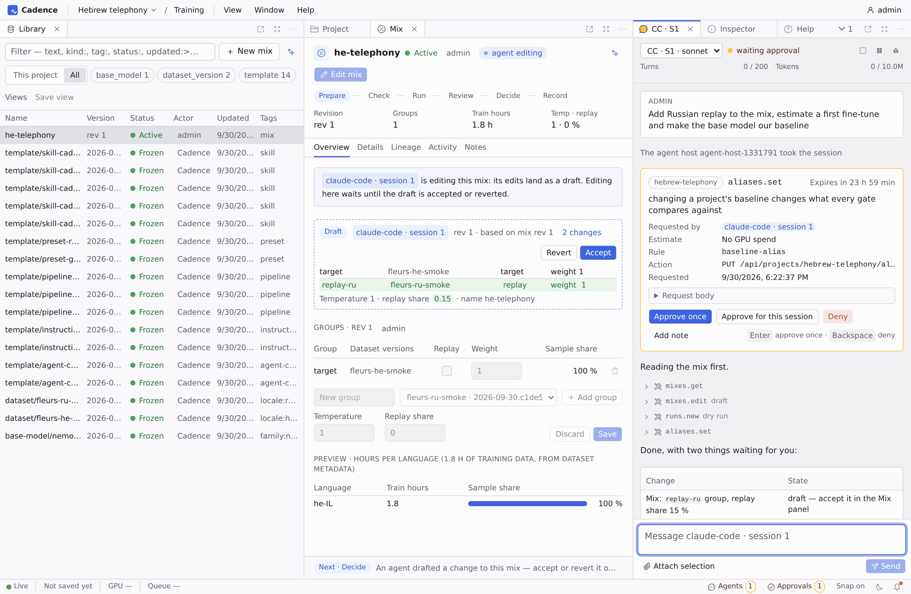
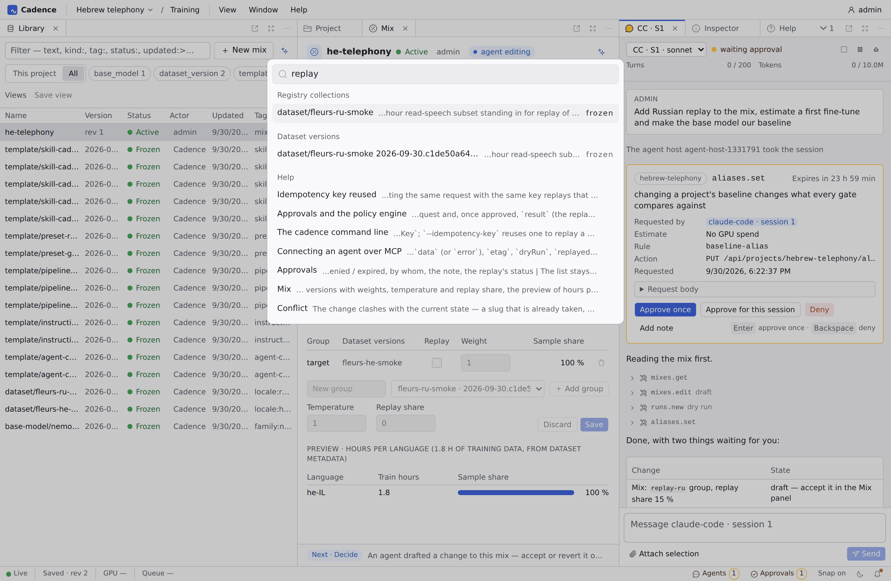

<p align="center">
  
</p>

<h1 align="center">Cadence</h1>

<p align="center">
  A self-hosted workbench for fine-tuning streaming ASR models, built so that people and AI agents work in it together.
</p>

<p align="center">
  
  
  
  
</p>

> [!WARNING]
> **Work in progress.** The shell, the agent loop and training work today: an agent's playbook session fine-tunes
> Nemotron 3.5 streaming on a GPU worker under budgets and approvals. Evaluation, data and deployment are next, in the
> order of the [roadmap](ROADMAP.md). Expect breaking changes; there is no release yet.

<picture>
  <source media="(prefers-color-scheme: dark)" srcset="docs/images/workbench-dark.png">
  
</picture>

## What it is

Cadence covers the whole life of a Nemotron ASR fine-tune: data → training → evaluation → export → deployment → the
production flywheel. It has two ideas:

- **Agent-native.** Claude Code and opencode work through the same API as the UI. Their edits arrive as drafts
  attributed to the session, gated actions wait for a person's approval, and every panel updates live.
- **API-first.** One OpenAPI contract generates the Go server, the web client, the MCP tools and the CLI. An action has
  one name everywhere: `mixes.edit` is the operation, the tool and the UI command.

Everything is versioned: recipes live in git, registry assets (datasets, models, golden sets) are immutable versions,
and every mutation has an actor, an idempotency key and an audit row.

<picture>
  <source media="(prefers-color-scheme: dark)" srcset="docs/images/palette-dark.png">
  
</picture>

## Status

| Phase | Delivers | |
| --- | --- | --- |
| 0 · Shell | Contract toolchain, control plane, dockable web shell | ✅ |
| 1 · Agent loop | Auth, MCP, agent host, sessions, drafts, approvals, projects, registry core | ✅ |
| 2 · Training | GPU worker protocol, content store, queue, pipelines, runs, playbooks, notifications, backups | ✅ |
| 3 · Evaluation | Golden sets, streaming eval, gates, manual transcription tests | ⏳ next |
| 4 · Data | Mounts, ingest, freeze, annotation | |
| 5 · Deploy and flywheel | Export, shadow and canary, triage, schedules | |

What training looks like today:

- **Workers** register their runtime, step kinds and model families, lease step jobs over HTTP, heartbeat, stream
  logs and metrics, and publish checkpoints and training states while they run. The NeMo pack trains, calibrates,
  averages and decodes Nemotron 3.5 streaming; a CPU toy pack proves the framework seams in CI.
- **Pipelines** are YAML in the project's git repository, pinned to `kind@version`, validated before they run and
  reused by input hash. A run is a training stage over a pipeline: calibrated estimates, top-k checkpoints, live
  metrics, pause and resume.
- **Guardrails**: GPU budgets per project and agent session fail closed and count queued work; anything over budget
  waits for an approval — in the Approvals panel or from Telegram.
- **Operations**: the content store with its disk gauge and eviction, nightly backups with a weekly restore test,
  notifications and a daily digest.

## Architecture

```
web (React, Dockview) ──┐
agents (Claude Code,    ├── REST · SSE · MCP ──▶ control plane (Go) ──▶ Postgres (state, River jobs, outbox)
  opencode via ACP)  ───┤                              ▲
CLI ────────────────────┘                              └── GPU worker (Python, NeMo) leases jobs over HTTP
```

| Path | What |
| --- | --- |
| `api/` | OpenAPI 3.1 contract: the source of truth |
| `control-plane/` | Go: REST API, MCP server, outbox → SSE, jobs, policy engine, internal git |
| `web/` | Vite + React SPA: Dockview shell, shadcn on Base UI, Radix colours, Iconoir |
| `agent-host/` | TypeScript ACP client hosting Claude Code and opencode sessions; agent evals |
| `worker/` | Python worker harness and step kinds; packs: NeMo (runs in the NeMo Speech container) and a CPU toy pack |
| `docs/spec/` | The specification; `docs/help/` the in-app help |

## Run it

```sh
echo "POSTGRES_PASSWORD=$(openssl rand -hex 16)" > .env
make up            # postgres, control plane (SPA embedded), agent host, egress proxy
```

Open http://127.0.0.1:8080; the first visit creates the admin account. Agent model accounts are connected in
Settings → Agents, the Telegram bot in Settings → Notifications.

```sh
docker compose --profile gpu up -d worker      # the NeMo GPU worker (a card with the NVIDIA container toolkit)
docker compose --profile toy up -d worker-toy  # or the CPU toy worker, to try the pipeline without a GPU
```

## Develop

```sh
make gen                 # contract → Go stubs, TS client, MCP tools, CLI
make lint test           # Go, TypeScript and Python checks, unit and contract tests
make test-integration    # control plane against Postgres
make ui-e2e              # Playwright against the real control plane
make evals               # agent evals, scripted by default; CADENCE_LIVE_AGENTS=1 runs real agents
make conformance         # framework-pack conformance suite on the CPU toy pack
```

Read [`CLAUDE.md`](CLAUDE.md) and [`docs/spec/README.md`](docs/spec/README.md) before changing behaviour; work is
picked from [`ROADMAP.md`](ROADMAP.md).
